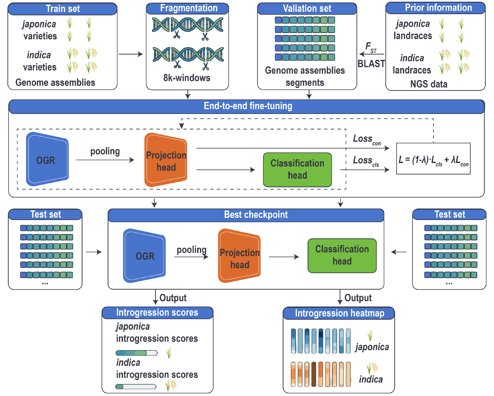
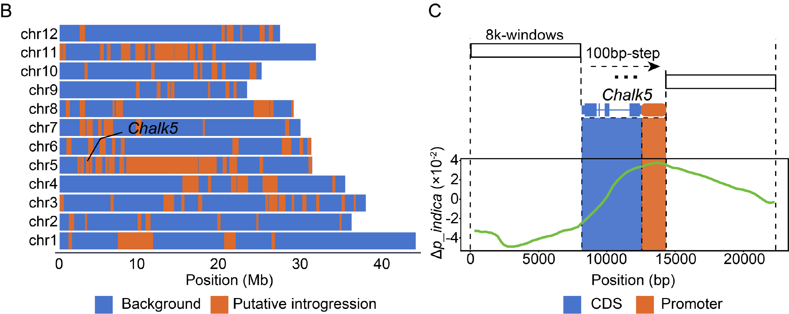

# ScenarioⅠ: Identification of *indica*-*japonica* Introgression

## 1. Overview

This case aims to exploit the capacity of the OGR foundation model for fine-scale inference of subspecies origin across the rice genome, enabling the identification of introgression between *indica* (*Oryza sativa* subsp. *indica*) and *japonica* (*Oryza sativa* subsp. *japonica*). Current phylogenetic methods and SNP-based population comparison analysis are often dependent on reference genomes. They are not readily scalable to newly introduced samples without reconstructing population comparison frameworks, and may be biased in genomic regions with low sequence diversity. So we proposed an alignment- and variant-free framework based on OGR that operates directly on genome assemblies for fine-scale and robust detection of *indica*-*japonica* introgression.

## 2. Method

Based on the sequence representation capabilities of the OGR foundation model, this study constructs a prediction framework that maps genomic sequences to subpopulation origin probabilities, thereby enabling the inference of ancestry introgression between *indica* and *japonica*. The overall workflow is described below:



### 2.1 Data preparation

- 25 *indica* and 25 temperate *japonica* accessions from the 3KRGP collection.
- Within each subspecies: 15 training, 5 validation, 5 test.
- Training windows: raw sequences trimmed of trailing `N`, 8,000 bp windows, 7,000 bp stride.
- Validation/test windows: BLAST-selected high-differentiation regions from an FST > 0.9 reference set.
- YF47 analysis: whole-genome windows with 8,000 bp window and 8,000 bp stride.
- *Chalk5* fine-scale analysis: 8,000 bp windows with 100 bp stride.

Each subspecies has 15 training, 5 validation, and 5 test samples. The full sample list is shown below.

| Sample Name | ID_3K | Region | Subpop | Set |
| :--- | :--- | :--- | :--- | :--- |
| Funingzipigengzi | B067 | China | *Indica* | Train Set |
| Jinbaoyin | B075 | China | *Indica* | Train Set |
| Minbeiwanxian | B076 | China | *Indica* | Train Set |
| Esiniu | B079 | China | *Indica* | Train Set |
| Xugunuo | B085 | China | *Indica* | Train Set |
| SanQishiluo | B088 | China | *Indica* | Train Set |
| Qitougu | B093 | China | *Indica* | Train Set |
| Xianggu | B108 | China | *Indica* | Train Set |
| Xiaobaimi | B132 | China | *Indica* | Train Set |
| Honggenghangu3 | B135 | China | *Indica* | Train Set |
| Jiefangxian | B198 | China | *Indica* | Train Set |
| Biwusheng | B203 | China | *Indica* | Train Set |
| Xuanenchangtanqingzhan | B214 | China | *Indica* | Train Set |
| Menjiagao 1 | B227 | China | *Indica* | Train Set |
| Laozaogu | B246 | China | *Indica* | Train Set |
| Heidu 4 | B081 | China | *Indica* | Validation Set |
| Mowangguneiza | B095 | China | *Indica* | Validation Set |
| Aizizhan | B131 | China | *Indica* | Validation Set |
| Lucaihao | B208 | China | *Indica* | Validation Set |
| Xiangdao | B244 | China | *Indica* | Validation Set |
| Qiuqianbai | B072 | China | *Indica* | Test Set |
| Jinxibai2 | B073 | China | *Indica* | Test Set |
| Hanmadao4 | B216 | China | *Indica* | Test Set |
| Honggu | B217 | China | *Indica* | Test Set |
| Menjiading 2 | B229 | China | *Indica* | Test Set |
| Sansuijin | B002 | China | Temperate *japonica* | Train Set |
| Zaoshengbai | B003 | China | Temperate *japonica* | Train Set |
| Gongchengxiang | B045 | Japan | Temperate *japonica* | Train Set |
| Laoguangtou 83 | B070 | China | Temperate *japonica* | Train Set |
| Zimangfeie | B111 | China | Temperate *japonica* | Train Set |
| Lengshuinuo | B148 | China | Temperate *japonica* | Train Set |
| Yelicanghua | B161 | China | Temperate *japonica* | Train Set |
| Baigedao | B162 | China | Temperate *japonica* | Train Set |
| Zhuyuan | B168 | Japan | Temperate *japonica* | Train Set |
| Hongmisandan | B199 | China | Temperate *japonica* | Train Set |
| Longhuamaohu | B204 | China | Temperate *japonica* | Train Set |
| Cunsanli | B205 | China | Temperate *japonica* | Train Set |
| Cungunuo | B223 | China | Temperate *japonica* | Train Set |
| Heimangdao | B226 | China | Temperate *japonica* | Train Set |
| Haobayong 1 | B228 | China | Temperate *japonica* | Train Set |
| Wanshi | B005 | Japan | Temperate *japonica* | Test Set |
| Qiutianxiaoting | B046 | Japan | Temperate *japonica* | Test Set |
| Yuyannuo | B136 | China | Temperate *japonica* | Test Set |
| Ailuyu | B169 | Japan | Temperate *japonica* | Test Set |
| Chimao | B182 | Japan | Temperate *japonica* | Test Set |
| Heibiao | B001 | China | Temperate *japonica* | Validation Set |
| Dandongludao | B069 | China | Temperate *japonica* | Validation Set |
| Muxiqiu | B071 | China | Temperate *japonica* | Validation Set |
| Laohongdao | B103 | China | Temperate *japonica* | Validation Set |
| Qingnuo Kyohatamochi | B183 | Japan | Temperate *japonica* | Validation Set |

### 2.2 Model architecture

- Backbone: the pretrained rice OGR model (1.25B parameters, 8 kb context).
- Fine-tuning: LoRA on attention `q_proj` and `v_proj` (rank = 16, alpha = 32, dropout = 0.1).
- Pooling: masked mean pooling over token outputs.
- Projection head: a two-layer MLP from 1024 to 512 to 128.
- Classification head: output logits, converted to probabilities for [$P_{\textit{japonica}}$, $P_{\textit{indica}}$] via Sigmoid.

### 2.3 Loss

- Joint objective: `L = (1 - lambda) * L_cls + lambda * L_con`
- `L_cls`: BCEWithLogitsLoss classification loss.
- `L_con`: supervised contrastive loss for tighter intra-class and wider inter-class separation.
- `lambda`: 0.1.

### 2.4 Training setup

- Optimizer: AdamW.
- Learning rate: 1e-5.
- Weight decay: 0.01.
- Scheduler: cosine decay with 5% warmup.
- Batch size: 4; gradient accumulation: 8.
- Supports DDP/NCCL and FP16 mixed precision.

### 2.5 Evaluation Rules

- Default decision threshold: ε = 0.5.
- *`japonica`* if $P_{\textit{japonica}}$ >= ε and $P_{\textit{indica}}$ < ε.
- *`indica`* if $P_{\textit{indica}}$ >= ε and $P_{\textit{japonica}}$ < ε.
- Otherwise, mark as uncertain.
- Map window predictions back to genome coordinates for introgression tracks.
- Evaluation metrics include AUC and ACC.


## 3. Results

### 3.1 Model Evaluation

Model performance is evaluated on the test set using the true subpopulation labels of each sample. Classification performance is assessed using AUC (Area Under the Curve) and ACC (Accuracy), which together reflect the model’s overall ability to distinguish subpopulation origins.

|           **DataSet**           | **ACC** | **AUC** |
| :------------------------------------: | :-----------: | :-----------: |
| Test Set |  0.7895     |     0.8644     |

### 3.2 Case Study

We applied this framework to analyze *indica* introgression in Yanfeng 47 (YF47), an elite *japonica* cultivar with a history of inter-subspecific hybridization. To minimize prediction ambiguity arising from shared genomic regions, we established a 95th percentile (Q95) confidence threshold based on the ancestral probability distribution of pure *japonica* landraces. Additionally, a regional aggregation strategy—calculating the mean of the top 10 high-scoring 8-kb fragments within a 256-kb sliding window—was employed to quantify local introgression intensity. This approach successfully identified multiple putative *indica* introgression regions across the genome, notably surrounding the *Chalk5* locus.

To further resolve the ancestral contribution at *Chalk5*, we conducted a fine-scale perturbation scan at a 100-bp resolution. The results revealed that the enhanced *indica* ancestral signals were primarily concentrated in the promoter region rather than the coding sequence, suggesting that this introgressed haplotype may modulate gene expression via cis-regulatory variation.



## 4. Project structure

```
1.identification_of_indica-japonica_introgression/
├── configs/
│   └── config_tuning.yaml      # Default LoRA fine-tuning config
├── models/
│   └── model.py                # FullModel and related definitions
├── rice_datasets/
│   ├── dataset.py              # RiceDataset implementation
│   └── arrow_cache.py          # Arrow token cache builder/loader
├── trainer/
│   └── trainer.py              # ContrastiveTrainer with joint loss
├── utils/
│   ├── trainer_utils.py        # SupConLoss, metrics, checkpoint utilities
│   └── utils.py
├── scripts/
│   ├── run_train.py            # Training entry point
│   ├── run_inference.py        # Inference entry point
│   └── run_tokenize.py         # Arrow cache preprocessing
├── run_train.sh
├── run_inference.sh
├── run_tokenize.sh
├── run_tensorboard.sh
├── create_env.sh
└── requirements.txt
```

## 5. Environment setup

### Quick install

```bash
bash create_env.sh
conda activate env_introgression_analysis
```

Or manually:

```bash
conda create -n env_introgression_analysis python=3.11 -y
conda activate env_introgression_analysis
pip install --upgrade pip
pip install -r requirements.txt
```

## 6. Data preparation

### Directory layout

Data directory configured by `data.data_dir` should contain:

```
{data_dir}/
├── datasets_info.yaml
└── {dataset_name}/
    ├── train.jsonl
    ├── eval.jsonl
    └── test.jsonl
```

### JSONL format

Each line should be a JSON object with a sequence field and a label field configured in `datasets_info.yaml`.

JSONL example per line:

```json
{"sequence": "ATCGATCG...", "label": [1, 0]}
```

## 7. Configuration

Config files are YAML and support `${ENV_VAR}` expansion. The default config is `configs/config_tuning.yaml`.

Key config sections:

- `model`: pretrained model path and pooling settings.
- `lora`: LoRA fine-tuning parameters.
- `data`: dataset path, dataset name, and split names.
- `tokenizer`: Arrow cache settings.
- `train`: learning rate, batch size, scheduler, and contrastive weight.
- `projection`: projection head dimensions.
- `task`: task type and label count.

Example config snippet:

```yaml
lora:
  use_lora: true
  r: 16
  alpha: 32
  dropout: 0.1
  target_modules: [q_proj, v_proj]
tokenizer:
  use_arrow_token_cache: true
  tokenize_dir: "${MNT_DEFAULT}/Workspace/benchmarks_rice_data/tokenize"
train:
  batch_size: 4
  gradient_accumulation_steps: 8
  lr: 1e-5
  weight_decay: 0.01
  lr_scheduler_type: cosine
  warmup_ratio: 0.05
  lambda_contrastive: 0.1
  fp16: true
projection:
  dims: [1024, 512, 128]
```

## 8. Usage

Before running, set required environment variables:

```bash
export MNT_DEFAULT="/mnt/rice/default"
export DATASET_NAME="your_dataset_name"
export RUN_NAME="experiment_name"
```

### 8.1 Build Arrow token cache

If `tokenizer.use_arrow_token_cache` is enabled, preprocess with:

```bash
python scripts/run_tokenize.py \
  --config configs/config_tuning.yaml \
  --split-mode train,eval,test
```

Or:

```bash
bash run_tokenize.sh
```

### 8.2 Training

Single GPU:

```bash
python scripts/run_train.py --config configs/config_tuning.yaml
```

Multi-GPU example:

```bash
torchrun --nproc_per_node=8 scripts/run_train.py \
  --config configs/config_tuning.yaml
```

Or:

```bash
bash run_train.sh
```

### 8.3 Inference

```bash
python scripts/run_inference.py \
  --config configs/config_tuning.yaml \
  --checkpoint /path/to/checkpoints/checkpoint-XXXX
```

Multi-GPU inference:

```bash
accelerate launch --num_processes=8 scripts/run_inference.py \
  --config configs/config_tuning.yaml \
  --checkpoint /path/to/checkpoints/checkpoint-XXXX
```

Predictions can be used to generate introgression maps. The threshold is controlled by `train.sigmoid_threshold` (default `0.5`).

### 8.4 TensorBoard

```bash
tensorboard --logdir /path/to/results --port 6006
```

## 9. Output layout

Results are saved under `{output_dir}/{model_name}/{dataset_name}/{run_name}/`:

```
{run_name}/
├── checkpoints/
├── logs/
└── metrics/
    ├── test_metrics.json
    ├── inference_results_*.tsv
    └── ...
```